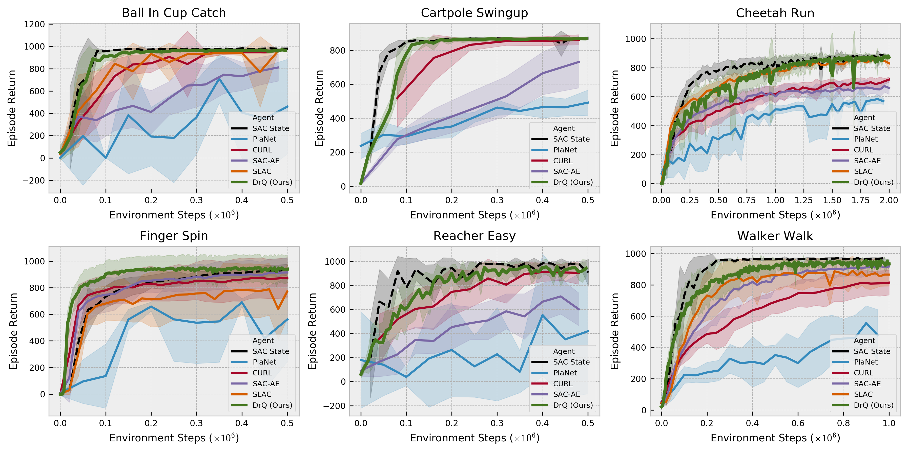
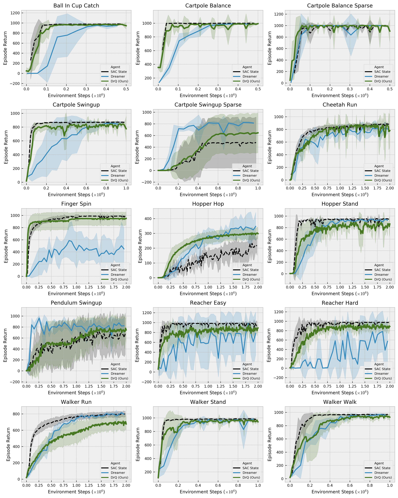

# DrQ: Data regularized Q

This is a PyTorch implementation of **DrQ** from

**Image Augmentation Is All You Need: Regularizing Deep Reinforcement Learning from Pixels** by

[Denis Yarats*](https://cs.nyu.edu/~dy1042/), [Ilya Kostrikov*](https://github.com/ikostrikov), [Rob Fergus](https://cs.nyu.edu/~fergus/pmwiki/pmwiki.php).

*Equal contribution. Author ordering determined by coin flip.

[[Paper]](https://arxiv.org/abs/2004.13649) [[Webpage]](https://sites.google.com/view/data-regularized-q)

## Citation
If you use this repo in your research, please consider citing the paper as follows
```
@article{kostrikov2020image,
    title={Image Augmentation Is All You Need: Regularizing Deep Reinforcement Learning from Pixels},
    author={Ilya Kostrikov and Denis Yarats and Rob Fergus},
    year={2020},
    eprint={2004.13649},
    archivePrefix={arXiv},
    primaryClass={cs.LG}
}
```

## Requirements
We assume you have access to a gpu that can run CUDA 9.2. Then, the simplest way to install all required dependencies is to create an anaconda environment by running
```
conda env create -f conda_env.yml
```
After the instalation ends you can activate your environment with
```
conda activate drq
```

## Instructions
To train the DrQ agent on the `Cartpole Swingup` task run
```
python train.py env=cartpole_swingup
```
**you can get the state-of-the-art performance in under 3 hours.**

To reproduce the results from the paper run
```
python train.py env=cartpole_swingup batch_size=512 action_repeat=8
```

This will produce the `runs` folder, where all the outputs are going to be stored including train/eval logs, tensorboard blobs, and evaluation episode videos. To launch tensorboard run
```
tensorboard --logdir runs
```

The console output is also available in a form:
```
| train | E: 5 | S: 5000 | R: 11.4359 | D: 66.8 s | BR: 0.0581 | ALOSS: -1.0640 | CLOSS: 0.0996 | TLOSS: -23.1683 | TVAL: 0.0945 | AENT: 3.8132
```
a training entry decodes as
```
train - training episode
E - total number of episodes
S - total number of environment steps
R - episode return
D - duration in seconds
BR - average reward of a sampled batch
ALOSS - average loss of the actor
CLOSS - average loss of the critic
TLOSS - average loss of the temperature parameter
TVAL - the value of temperature
AENT - the actor's entropy
```
while an evaluation entry
```
| eval  | E: 20 | S: 20000 | R: 10.9356
```
contains
```
E - evaluation was performed after E episodes
S - evaluation was performed after S environment steps
R - average episode return computed over `num_eval_episodes` (usually 10)
```

## The PlaNet Benchmark
**DrQ** demonstrates the state-of-the-art performance on a set of challenging image-based tasks from the DeepMind Control Suite (Tassa et al., 2018). We compare against PlaNet (Hafner et al., 2018), SAC-AE (Yarats et al., 2019), SLAC (Lee et al., 2019), CURL (Srinivas et al., 2020), and an upper-bound performance SAC States (Haarnoja et al., 2018). This follows the benchmark protocol established in PlaNet (Hafner et al., 2018).


## The Dreamer Benchmark
**DrQ** demonstrates the state-of-the-art performance on an extended set of challenging image-based tasks from the DeepMind Control Suite (Tassa et al., 2018), following the benchmark protocol from Dreamer (Hafner et al., 2019). We compare against Dreamer (Hafner et al., 2019) and an upper-bound performance SAC States (Haarnoja et al., 2018).



## Acknowledgements
We used [kornia](https://github.com/kornia/kornia) for data augmentation.
